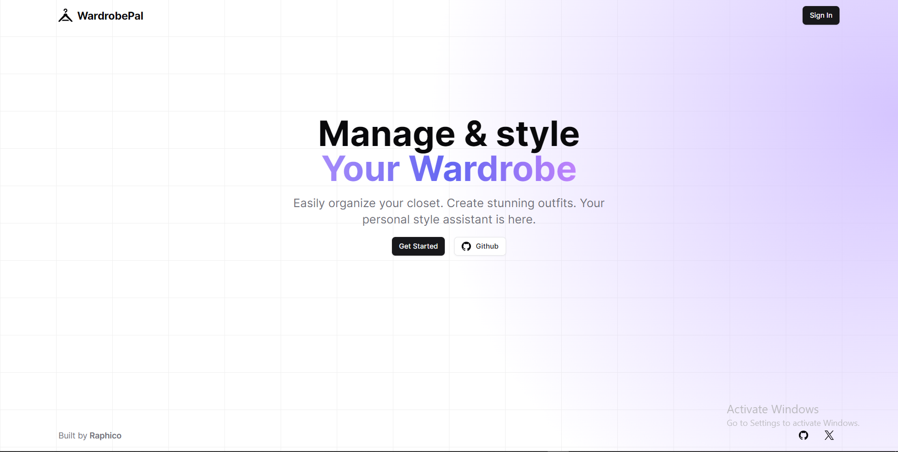

# [WardrobePal](https://wardrobe-pal.vercel.app/)

A web app for managing clothing inventory and creating virtual outfits

[](https://wardrobe-pal.vercel.app/)

## Tech Stack

- **Framework:** [Next.js](https://nextjs.org)
- **Styling:** [Tailwind CSS](https://tailwindcss.com)
- **User Management:** [clerk](https://clerk.com/)
- **Baas:** [Convex](https://www.convex.dev/)
- **UI Components:** [shadcn/ui](https://ui.shadcn.com)

## Roadmap

- [x] Project setup
- [x] SEO optimization
- [x] add landing page
- [x] setup convex
- [x] Implement authentication with clerk
- [x] Develop wardrobe page with CRUD operations for clothing items
- [x] Update worn count for each item
- [ ] Add dashboard
- more

## Running Locally

1. Clone the repository

   ```bash
   git clone https://github.com/Raphico/Zenflow
   ```

2. Install dependencies using npm

   ```bash
   npm install
   ```

3. Copy the `.env.example` to `.env` and update the variables.

   ```bash
   cp .env.example .env
   ```

4. Start the development server

   ```bash
   npm run dev
   ```
